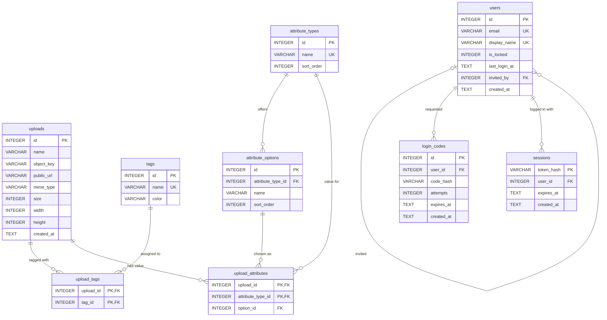

# Data model

All metadata lives in a single Cloudflare D1 (SQLite) database. The files themselves are stored in Cloudflare R2; the database only holds their object key and public URL. The schema is defined by the numbered files in `migrations/` and applied with `npm run migrate`.

## Tags vs. attributes

Both classify images, but they follow different rules:

| | Tags | Attributes |
|---|---|---|
| Per image | any number, including none | **exactly one** option per attribute type |
| Values | free-form, created on the fly | fixed list of options, maintained at `/attributes` |
| Example | `Chroniken25`, `Stefan` | Event = Chroniken, Jahr = 25, Creator = Stefan |

## Tables

### `uploads` (`0001`, `0004`)

One row per uploaded file.

| Column | Type | Notes |
|---|---|---|
| `id` | `INTEGER` PK | autoincrement |
| `name` | `VARCHAR(255)` | original file name |
| `object_key` | `VARCHAR(255)` | R2 key: random UUID plus the original extension |
| `public_url` | `VARCHAR(255)` | public R2 URL of the object |
| `mime_type` | `VARCHAR(100)` | nullable |
| `size` | `INTEGER` | bytes |
| `width`, `height` | `INTEGER` | nullable; `NULL` for non-images or unsupported formats |
| `created_at` | `TEXT` | ISO 8601 UTC, set by the database |

### `tags` (`0002`) and `upload_tags` (`0003`)

`tags` holds `id`, a unique `name` and a `color` (hex; derived from the name if none is given). `upload_tags` is the many-to-many link with primary key `(upload_id, tag_id)`. Both foreign keys use `ON DELETE CASCADE`.

### `attribute_types` (`0005`)

The kinds of attributes every image must have, e.g. "Event".

| Column | Type | Notes |
|---|---|---|
| `id` | `INTEGER` PK | autoincrement |
| `name` | `VARCHAR(100)` | unique |
| `sort_order` | `INTEGER` | display order (columns, form fields); new types are appended |

### `attribute_options` (`0005`)

The allowed values of one attribute type, e.g. "Chroniken", "Conquest", "Siegel" for "Event".

| Column | Type | Notes |
|---|---|---|
| `id` | `INTEGER` PK | autoincrement |
| `attribute_type_id` | `INTEGER` FK → `attribute_types.id` | `ON DELETE CASCADE` |
| `name` | `VARCHAR(100)` | unique within its type (`UNIQUE (attribute_type_id, name)`) |
| `sort_order` | `INTEGER` | order within the type; new options are appended |

`UNIQUE (id, attribute_type_id)` looks redundant, but it exists so that `upload_attributes` can reference an option together with its type (see below).

### `upload_attributes` (`0005`)

The value an image has for an attribute type.

| Column | Type | Notes |
|---|---|---|
| `upload_id` | `INTEGER` FK → `uploads.id` | `ON DELETE CASCADE` |
| `attribute_type_id` | `INTEGER` FK → `attribute_types.id` | `ON DELETE CASCADE` |
| `option_id` | `INTEGER` | with `attribute_type_id`: FK → `attribute_options (id, attribute_type_id)` |

### `users` (`0006`, `0007`)

Users of the public frontend (`muenzquell-fe`). They are created and log in there, and are managed in this backend at `/users`, where they can be locked and unlocked.

| Column | Type | Notes |
|---|---|---|
| `id` | `INTEGER` PK | autoincrement |
| `email` | `VARCHAR(255)` | unique, case-insensitive (`COLLATE NOCASE`) |
| `display_name` | `VARCHAR(100)` | unique, case-insensitive (unique index `idx_users_display_name`, `COLLATE NOCASE`) |
| `is_locked` | `INTEGER` | `0` = active, `1` = locked; `CHECK (is_locked IN (0, 1))` |
| `last_login_at` | `TEXT` | ISO 8601 UTC, set by the frontend on login. `NULL` means the user has never logged in, i.e. the invitation hasn't been accepted yet |
| `invited_by` | `INTEGER` FK → `users.id` | the user who sent the invitation; `NULL` for users nobody invited. `ON DELETE SET NULL`: deleting the inviter keeps the invited user |
| `created_at` | `TEXT` | ISO 8601 UTC, set by the database |

The database only stores the lock. Refusing login for locked users is the job of the frontend's login.

### `login_codes` (`0008`)

One-time codes for the frontend's login: a user enters their e-mail or display name, receives a code by e-mail and logs in with it. Written and read only by the frontend.

| Column | Type | Notes |
|---|---|---|
| `id` | `INTEGER` PK | autoincrement |
| `user_id` | `INTEGER` FK → `users.id` | `ON DELETE CASCADE` |
| `code_hash` | `VARCHAR(64)` | keyed hash of the code, never the code itself |
| `attempts` | `INTEGER` | failed attempts; the frontend rejects the code once the limit is reached |
| `expires_at` | `TEXT` | ISO 8601 UTC |
| `created_at` | `TEXT` | ISO 8601 UTC, set by the database; also used to throttle new codes |

Only the newest code of a user is valid: requesting a new one deletes the previous ones, a successful login deletes the used one.

### `sessions` (`0008`)

Logged-in sessions of the frontend. The browser holds a random token in a cookie; the database stores only its hash.

| Column | Type | Notes |
|---|---|---|
| `token_hash` | `VARCHAR(64)` PK | SHA-256 of the session token |
| `user_id` | `INTEGER` FK → `users.id` | `ON DELETE CASCADE` |
| `expires_at` | `TEXT` | ISO 8601 UTC |
| `created_at` | `TEXT` | ISO 8601 UTC, set by the database |

The frontend accepts a session only while it hasn't expired **and** its user isn't locked. It looks the session up on every request, so deleting the row logs the user out immediately.

The backend uses this table read-and-delete only:

- `/users` shows a user as logged in while they have at least one unexpired session. That means a valid login, not necessarily that someone is using the site right now; there is no last-activity timestamp.
- **Ausloggen** (`DELETE /api/users/[id]/sessions`) deletes all sessions of the user.
- **Sperren** also deletes the user's sessions, so unlocking later doesn't revive them.

## Rules for attribute values

**At most one value per type** is enforced by the database: the primary key is `(upload_id, attribute_type_id)`. Saving a new value replaces the old one (`INSERT … ON CONFLICT … DO UPDATE`).

**The option must belong to the type**: the composite foreign key `(option_id, attribute_type_id)` rejects an option from a different attribute type.

**At least one value per type cannot be enforced by the database.** When a new attribute type is created, all existing images have no value for it yet. Completeness is therefore checked by the application in `validateAttributeValues` (`lib/attributes.ts`):

- `POST /api/upload`: rejects the request with `400` if any type is missing or invalid. This check runs before anything is written to R2.
- `PUT /api/uploads/[id]/attributes`: requires a valid value for **every** type. This is the Save button on the edit page `/uploads/[id]`.

Images with missing values are flagged in the overview ("Attribute fehlen"). They can't be saved on the edit page until every type has a value.

An attribute type without options blocks both uploading and saving, because no valid value exists.

## Deletion behaviour

| Deleted | Effect |
|---|---|
| Upload | its `upload_tags` and `upload_attributes` rows go with it (cascade); the R2 object is deleted by the API route |
| Tag | its `upload_tags` rows are deleted |
| Attribute type | its options and all image values for it are deleted (the UI asks for confirmation) |
| Attribute option | **refused (`409`) while any image still uses it**; reassign those images first |
| User | users they invited keep existing, their `invited_by` becomes `NULL`; their `login_codes` and `sessions` are deleted |

## Code

| Area | File |
|---|---|
| D1 HTTP client | `lib/db.ts` |
| Uploads | `services/uploadService.ts`, `types/upload.ts` |
| Tags | `services/tagService.ts`, `types/tag.ts` |
| Attributes | `services/attributeService.ts`, `types/attribute.ts`, `lib/attributes.ts` (validation) |
| Users | `services/userService.ts`, `types/user.ts` |
